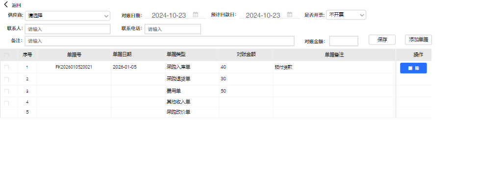

# 客户及供应商对账单功能说明

# 客户对账单模块说明

本模块主要是用于管理账期客户，按往来单据生成对账单及后续收款结算管理。

操作流程：1、在模块中选择客户往来单据生成对账单或客户结算模块选择单据生成对账结算单。

2、导出和打印对账单与客户确认，确认后系统审核结算单。

3、客户付款后，选择对账结算单进行收款结算，生成收款单及核销流水。

原型地址：https://modao\.cc/proto/oe78hqUNt827xmRDrZh6hE/sharing?view\_mode=device\&screen=rbpV8tmXEhbKE1tT2\&canvasId=sslluogoV8tmXEyil3nwKN \#ERP4\.0后台优化\-分享

|模块|说明|原型|
|---|---|---|
|客户对账结算单（列表） |1. 列表主要是展示已生成的对账单记录，记录包含的字段信息：     1. 单据号：新建单据自动生成回显。     2. 客户编号：单据客户编号     3. 客户名称：单据客户名称     4. 业务员：客户档案默认业务员     5. 对账日期：单据对账日期     6. 预计回款日：本对账单客户预计回款日期。     7. 状态：审核状态     8. 对账金额：对账单金额     9. 已收款金额：对账单客户已付款金额（含抹零，明细单据收款了，已收款金额自动更新）。     10. 抹零金额：单据实际付款时的抹零及优惠金额。     11. 收款状态：未收款/部分收款/完成收款     12. 备注     13. 制单人：单据新建人     14. 制单时间：单据新建时间     15. 审核人：单据审核人     16. 审核时间：单据审核时间 2. 查询条件：     1. 日期：默认最近一个月，查询时按对账日期返回结果。     2. 客户：下拉选择客户。支持多选。返回选择客户的记录。     3. 业务员:下拉选择业务员，支持多选。返回选择业务员的记录。     4. 备注：按输入的信息模糊查询返回匹配的记录。     5. 收款状态：默认未收款。下拉选择：未收款/部分收款/完成收款/全部 3. 操作按钮     1. 新建：点击弹出单据新建窗口。     2. 编辑：点击弹出单据编辑窗口。如果单据在已审核状态，弹出窗口只可查看不可编辑。     3. 删除：未审核状态单据可删除。删除单据后，还原添加到对账单源单据信息。     4. 审核：对账单确认后审核生效，审核后可进行收款操作。     5. 反审核：对账单已审核未收款状态可反审核。反审核后可重新编辑修改。     6. 收款结算：已审核单据可以操作收款，弹出收款窗口。     7. 导出：点击导出，导出查出来的对账单记录。         1. 导出字段（按列表展示字段导出）             1. 单据号：对账单号             2. 对账日期：单据日期             3. 客户编号：客户编号             4. 客户名称：客户名称             5. 业务员：门店关联业务员姓名             6. 状态             7. 预计回款日：单据的预计回款日             8. 对账金额             9. 已收款金额             10. 抹零金额             11. 待结金额             12. 收款状态             13. 备注：单据备注             14. 制单人             15. 制单时间             16. 审核人             17. 审核时间     8. 搜索：点击按查询条件返回记录     9. 重置：返回进入时的默认查询条件。 4. 进入页面：     1. 默认显示未审核单据。| |
|详情页|1. 双击对账单，弹出展示对账单据详情。参考销售出库单或退货入库单的详情展示结 2. 详情页导出功能，点击导出按钮时弹出菜单选择：导出对账明细/导出对账商品明细     1. 导出对账明细         1. 对账单据号：对账单号         2. 对账日期：单据日期         3. 客户编号：客户编号         4. 客户名称：客户名称         5. 业务员：门店关联业务员姓名         6. 备注：对账单单据备注         7. 预计回款日：单据的预计回款日         8. 制单人         9. 制单时间         10. 审核人         11. 审核时间         12. 业务单据号         13. 单据日期         14. 单据类型：业务单据类型         15. 单据金额：业务单据对账金额         16. 单据备注：业务单据备注     2. 导出对账商品明细         1. 对账单据号：对账单号         2. 对账日期：单据日期         3. 客户编号：客户编号         4. 客户名称：客户名称         5. 业务员：门店关联业务员姓名         6. 备注：对账单单据备注         7. 预计回款日：单据的预计回款日         8. 制单人         9. 制单时间         10. 审核人         11. 审核时间         12. 业务单据号         13. 单据日期         14. 单据类型：业务单据类型         15. 单据备注：业务单据备注         1. 商品编号：明细单据商品编号。费用单显示空         2. 商品名称：明细单据商品名称。费用单显示费用类型         3. 条码：关联显示档案小单位条码。         4. 单位：单据单位。费用单显示空         5. 规格：档案规格。费用单显示空         6. 数量：单据单位数量：销售出库单正数。退货单负数。改价单、费用单显示空         7. 单价：单据单位单价。改价单、费用单显示空         8. 金额：销售出库单正数。退货单显示负数、费用单转负数显示。改价单按差额正负数展示。||
|对账单新建|1. 进入页面展示新建页： 2. 主数据：进入页面对账日期默认当前日期、预计回款日默认往后推7天。     1. 客户：下拉组件，单选。输入关键字定位门店。选择客户后自动跳到对账日期字段。     2. 对账日期回车后跳到预计回款日     3. 预计回款日不能小于对账日期。选择后跳到备注字段。     4. 联系人：选择客户后将客户档案的联系人带出来填入输入框，用户可修改保存在单据。     5. 联系电话：选择客户后将客户档案的联系人带出来填入输入框，用户可修改保存在单据     6. 备注：最多支持200个汉字。 3. 明细添加：点击添加单据弹出单据选择窗口，选择单据后返回明细。     1. 列表字段：         1. 单据号：返回的单号号。         2. 单据日期：返回单据的日期。         3. 单据类型：返回单据的类型：销售出库单、销售退货入库单、费用单、销售改价单。         4. 对账金额：返回的单据未收款金额。         5. 已收款金额：根据业务单据的已收款金额更新。         6. 未收款金额：根据对账金额和已收更新         7. 单据备注：返回的单据备注。     2. 添加单据（新窗口）         1. 进入后单据日期默认最近一年，用户可修改查询。         2. 列表：列表展示查询日期段内该客户未生成对账单的未完成收款的单据。按单据日期顺序排序。页脚对账金额汇总显示。             1. 单据号：单号编号             2. 客户名称：制作对账单的客户名称             3. 单据日期：单据日期             4. 单据类型：返回单据的类型：销售出库单、销售退货入库单、费用单、销售改价单。             5. 单据金额：单据的原金额             6. 未结算金额：未完成收款的金额。             7. 单据备注：返回的单据备注。         3. 选择添加              1. 勾选 单据点击【选择添加】将记录添加到对账单明细，不退出当前窗口，用户可继续添加记录。             2. 确定：如果选择了记录，点击确定后将选择的记录添加到对账单明细。             3. 取消：返回上一个页面不做操作。         4. 删除：删除一条明细记录。     3. 单明细记录变动后，更新表头的对账金额，让用户知道当前添加单据的对账总金额。     |     |
|对账单收款结算 |1. 在列表选择要结算的单据，点击【收款结算】弹出收款页面进行收款录入：（可以多选同一客户对账单进行合并收款。选择的单据有不同客户时，提示【只能对同一客户的单据进行合并结算】） 2. 收款页面     1. 经手人：进入页面默认为当前操作用户。     2. 记账日期：默认为当前日期，用户可修改。     3. 备注：按收款单的备注长度进行控制。     4. 应收金额：为选择的单据待结算总金额。     5. 抹零金额：进入页面默认为0。用户可手动输入数值，支持负数。     6. 抹零金额费用类型：下拉选择末级费用类型。     7. 待收金额：等于应收金额\-抹零金额     8. 剩余应收：等于待收金额\-各收款账户录入的收款金额。     9. 收款明细         1. 收款账户：下拉选择资金账户，只可选择最末级账户。         2. 收款金额：手动录入。             1. 如果待收金额大于零：收款金额须大于0，且各账户收款金额和不能大于待收金额。             2. 如果待收金额小于零：收款金额须小于0，且各账户收款金额和不能小于待收金额。         3. 收款凭证：可上传客户付款图片。         4. 操作：支持多账户收款。点击添加一个账户。多账户时，可以删除一条。但最终须保留一条收款明细。 3. 确认收款：     1. 确认收款后：         1. 生成收款单（收款单重要字段取值）。             1. 业务来源：客户对账结算单             2. 摘要：收款页面填的备注             3. 收款金额金额：各账户实收总金额             4. 记账日期：收款时录入的记账日期。             5. 经手人：收款时录入的经手人             6. 制单人、审核人：操作收款的人         2. 抹零金额生成费用单并自动结算。抹零正常费用收支类型为支出，负数为收入。         3. 收款单自动审核         4. 收款单审核后自动生成核销流水（包括原业务单及抹零费用单（核销金额为负向抹零金额）），并更新对账结算单已收款金额，对账结算单明细单据的已收款金额。如果是对结算单部分收款，则根据源单据的时间顺序先结算最老的单据。生成的核销流水是原单据。 |    |
|客户应收明细 |1、客户应收明细可以对已对账单据收款结算，结算后更新对账单的已收金额。 ||
|销售发货单单、销售退货单|增加【对账状态】标识。 对账单已审核：已对账、 未生成对账单：未对账 生成对账单未审核：对账中||

# 21 供应商对账结算模块说明

本模块主要是用于管理账期供应商，按往来单据生成对账单及后续付款结算管理。

操作流程：1、在模块中选择供应商往来单据生成对账单或供应商结算模块选择单据生成对账结算单。

2、导出和打印对账单与供应商确认，确认后系统审核结算单。

3、公司付款后，选择对账结算单进行付款结算，生成付款单及核销流水。

|模块|说明|原型|
|---|---|---|
|供应商对账单（列表） |1. 列表主要是展示已生成的对账单记录，记录包含的字段信息：     1. 单据号：新建单据自动生成回显。     2. 供应商编号：单据客户编号     3. 供应商名称：单据客户名称     4. 采购员：客户档案默认业务员     5. 对账日期：单据对账日期     6. 是否开票：按单据录入显示值。     7. 预计付款日：本对账单预计付款日期。     8. 状态：审核状态     9. 对账金额：对账单金额     10. 已付款金额：对账单已付款金额（含抹零）。     11. 抹零金额：单据实际付款时的抹零及优惠金额。     12. 付款状态：未付款/部分付款/完成付款     13. 备注     14. 制单人：单据新建人     15. 制单时间：单据新建时间     16. 审核人：单据审核人     17. 审核时间：单据审核时间 2. 查询条件：     1. 日期：默认最近一个月，查询时按对账日期返回结果。     2. 供应商：下拉选择供应商。支持多选。返回选择供应商的记录。     3. 采购员:下拉选择采购员，支持多选。返回选择采购员的记录。     4. 备注：按输入的信息模糊查询返回匹配的记录。     5. 付款状态：默认未付款。下拉选择：未付款/部分付款/完成付款/全部 3. 操作按钮     1. 新建：点击弹出单据新建窗口。     2. 编辑：点击弹出单据编辑窗口。如果单据在已审核状态，弹出窗口只可查看不可编辑。     3. 删除：未审核状态单据可删除。删除单据后，还原添加到对账单源单据信息。     4. 审核：对账单确认后审核生效，审核后可进行收款操作。     5. 反审核：对账单已审核未收款状态可反审核。反审核后可重新编辑修改。     6. 付款结算：已审核单据可以操作付款，弹出付款窗口。     7. 导出：点击后弹出二级菜单展示：         1. 列表导出：按当前查询条件返回的记录导出到EXCEL，按列表展示的数据导出。         2. 导出详情：在当前列表基础上导出明细单据对应的商品信息             1. 单据号：对账单号             2. 对账日期：单据日期             3. 供应商编号：供应商编号             4. 供应商名称：供应商名称             5. 采购员：供应商关联的采购员姓名             6. 联系人：单据中的联系人             7. 是否开票：             8. 联系电话：单据中的联系电话             9. 备注：单据备注             10. 预计付款日：单据的预计付款日期             11. 制单人             12. 制单时间             13. 审核人             14. 审核时间             15. 原单据号             16. 原单据日期             17. 单据类型：明细单据类型             18. 商品编号：明细单据商品编号。费用单显示空             19. 商品名称：明细单据商品名称。费用单显示费用类型             20. 条码：关联显示档案小单位条码。             21. 单位：单据单位。费用单显示空             22. 规格：档案规格。费用单显示空             23. 数量：单据单位数量：采购入库单正数。退货单、费用单负数。费用单显示1             24. 单价：单据单位单价。费用单显示费用单金额。改价单显示差额单价。             25. 金额：采购入库单正数。退货单、费用单负数。改价单按差额正负数展示。     8. 搜索：点击按查询条件返回记录     9. 重置：返回进入时的默认查询条件。 4. 进入页面：     1. 默认显示未审核单据。| |
|对账单新建|1. 进入页面展示新建页： 2. 主数据：进入页面对账日期默认当前日期。     1. 供应商：下拉组件，单选。输入关键字定位供应商。选择供应商后自动跳到对账日期字段。     2. 对账日期回车后跳到预计付款日     3. 预计付款日不能小于对账日期。选择后跳到备注字段。     4. 联系人：选择供应商后将供应商档案的联系人带出来填入输入框，用户可修改保存在单据。     5. 联系电话：选择供应商后将供应商档案的联系人带出来填入输入框，用户可修改保存在单据     6. 是否开票。下拉选择值 。     7. 备注：最多支持200个汉字。 3. 明细添加：点击添加单据弹出单据选择窗口，选择单据后返回明细。     1. 列表字段：         1. 单据号：返回的单号号。         2. 单据日期：返回单据的日期。         3. 单据类型：返回单据的类型：采购入库单、退货出库单、费用单、采购改价单。         4. 金额：返回的单据未付款金额。         5. 单据备注：返回的单据备注。     2. 添加单据（新窗口）         1. 进入后单据日期默认最近一年，用户可修改查询。         2. 列表：列表展示查询日期段内该供应商未生成对账单的未完成付款的单据。按单据日期顺序排序。页脚对账金额汇总显示。             1. 单据号：单号编号             2. 供应商名称：制作对账单的供应商名称             3. 单据日期：单据日期             4. 单据类型：返回单据的类型：采购入库单、退货出库单、费用单、采购改价单。             5. 单据金额：单据的原金额             6. 未结算金额：未完成付款的金额。             7. 单据备注：返回的单据备注。         3. 选择添加              1. 勾选 单据点击【选择添加】将记录添加到对账单明细，不退出当前窗口，用户可继续添加记录。             2. 确定：如果选择了记录，点击确定后将选择的记录添加到对账单明细。             3. 取消：返回上一个页面不做操作。         4. 删除：删除一条明细记录。     3. 单明细记录变动后，更新表头的对账金额，让用户知道当前添加单据的对账总金额。     |  |
|对账单付款结算|1. 在列表选择要结算的单据，点击【付款结算】弹出收款页面进行收款录入：（参照供应商结算的付款结算页面）（可以多选同一供应商对账单进行合并付款。选择的单据有不同供应商时，提示【只能对同一供应商的单据进行合并结算】） 2. 付款页面     1. 经手人：进入页面默认为当前操作用户。     2. 记账日期：默认为当前日期，用户可修改。     3. 备注：按付款单的备注长度进行控制。     4. 应付金额：为选择的单据待结算总金额。     5. 本次付款金额：各资金账户金额合计     6. 剩余应付：等于待付金额\-各付款账户录入的付款金额。     7. 付款明细         1. 付款账户：下拉选择资金账户，只可选择最末级账户。         2. 付款金额：手动录入。             1. 如果待付金额大于零：付款金额须大于0，且各账户付款金额和不能大于待付金额。             2. 如果待付金额小于零：付款金额须小于0，且各账户付款金额和不能小于待付金额。         3. 付款凭证：可上传客户付款图片。         4. 对方账户名：如果是供应商付款，调用供应商档案维护的账户信息下拉选择，返回账户名称         5. 操作：支持多资金账户付款。点击添加一个账户。多账户时，可以删除一条。但最终须保留一条付款明细。 3. 确认付款：     1. 确认付款后：         1. 生成付款单（付款单重要字段取值）。             1. 摘要：付款页面填的备注             2. 付款金额：实际付款金额             3. 付款类型：普通付款             4. 记账日期：付款时录入的记账日期。             5. 经手人：付款时录入的经手人             6. 制单人、审核人：操作收款的人         2. 付款单自动审核         3. 付款单审核后自动生成核销流水，并更新对账结算单已付款金额，对账结算单明细单据的已付款金额。如果是对结算单部分付款，则根据源单据的时间顺序先结算最老的单据。生成的核销流水是原单据。 |   |

